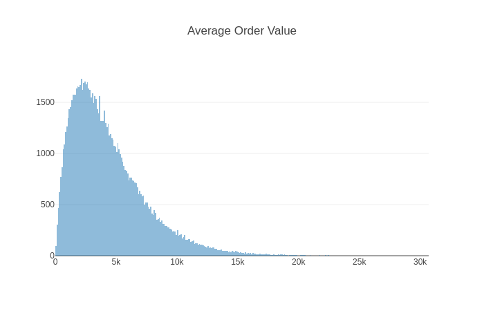

## Description
This project presents a simple API for using R plotting system and [plotly.js](https://github.com/plotly/plotly.js) library with [Jupyter](http://jupyter.org/).

## Usage
Downloading `plotly-latest.js` library in the corresponding library:
```bash
$PACKAGE_ROOT=~/pyvenv/lib/python3.6/site-packages # directory where notebook package is installed
cd $PACKAGE_ROOT/notebook/static/components/
mkdir plotly && cd plotly
wget https://cdn.plot.ly/plotly-latest.js
```

As far as `plotly-latest.js` is in the right place the API can be used in a notebook liked this:
```scala
import breeze.stats.distributions.{Gamma, RandBasis}

val d1 = new Gamma(shape=2, scale=2200)
kernel.display.content("text/html", hist(d1.sample(100000), title = "Average Order Value"))
```
